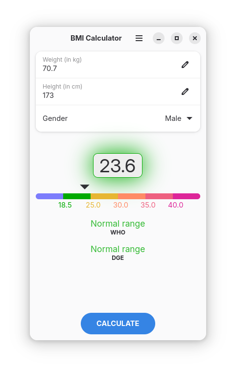
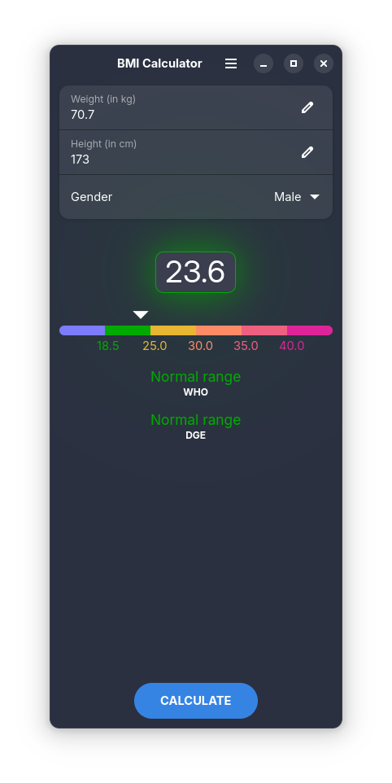
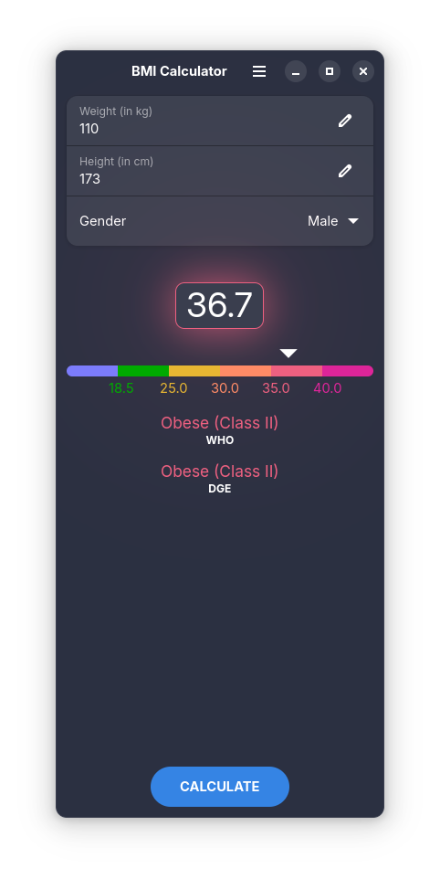
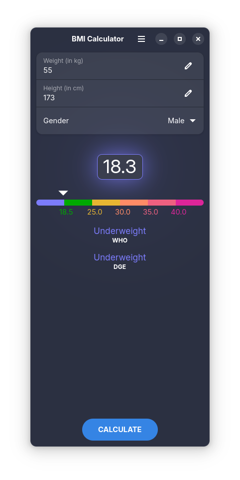

# BMI Calculator

BMI Calculator is a body mass index calculator built with GTK4 and LibAdwaita.

## Install
### Flatpak
BMI Calculator is available as a Flatpak:

__Version 1.0__

<a href="
https://github.com/johannesboehler2/bmicalculator/releases/download/v1.0/io.github.johannesboehler2.BmiCalculator.flatpak">
https://github.com/johannesboehler2/bmicalculator/releases/download/v1.0/io.github.johannesboehler2.BmiCalculator.flatpak</a>

__Version 1.1__

Scrollable content

<a href="
https://github.com/johannesboehler2/bmicalculator/releases/download/v1.1/io.github.johannesboehler2.BmiCalculator.flatpak">
https://github.com/johannesboehler2/bmicalculator/releases/download/v1.1/io.github.johannesboehler2.BmiCalculator.flatpak</a>

## Screenshots

by Johannes Böhler
